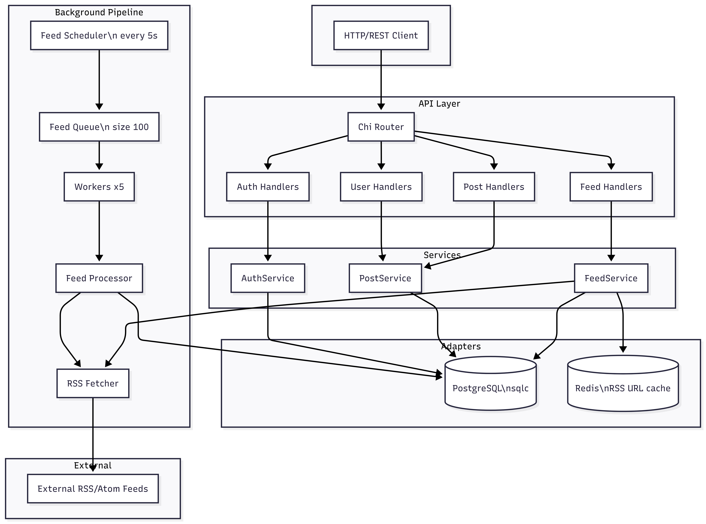

# RSS Aggregator

A **Go** backend that aggregates RSS/Atom feeds, stores posts in PostgreSQL, and serves them via a REST API. Users can register, subscribe to feeds, read a timeline, and mark posts as read or favorite. A background worker pool periodically fetches feeds and enriches the post store.

---

## Features

- **Auth** — Register, login, JWT access/refresh, logout
- **Feeds** — Create feed from site URL (auto-discovery), list, update, delete; subscribe/unsubscribe users
- **Posts** — List by feed, latest, search; timeline, mark read/favorite, user favorites
- **Background processing** — Scheduler pushes feeds into a queue; workers fetch, parse, and persist new posts
- **Caching** — Redis cache for discovered RSS URLs (site URL → feed URL) to speed up repeated adds

---

## System flow

High-level request flow and background pipeline:



**Flow in short:**

1. **Request path:** Client → Chi router → handlers → services → PostgreSQL / Redis (and feed fetcher for create/update).
2. **Background path:** Scheduler loads all feeds every 5s → enqueues to channel → 5 workers dequeue → Feed processor fetches RSS, parses, creates posts → DB; processor updates feed `last_fetched_at`.

---

## Tech stack

| Layer        | Technology        |
|-------------|--------------------|
| Language    | Go 1.25+          |
| HTTP        | Chi router        |
| Auth        | JWT (access + refresh) |
| DB          | PostgreSQL (pgx)  |
| DB access   | sqlc (type-safe SQL) |
| Cache       | Redis             |
| RSS parsing | gofeed            |
| Config      | env (caarlos0/env) + godotenv |

---

## Prerequisites

- **Go 1.25+**
- **Docker & Docker Compose** (for PostgreSQL and Redis)
- **goose** (for migrations): `go install github.com/pressly/goose/v3/cmd/goose@latest`

---

## Quick start (clone → run → test)

After cloning, you can run the API locally and test from your **browser** or **Postman**.

### 1. Clone and prepare env

```bash
git clone <your-repo-url>
cd rssagg
cp .env.example .env
# Edit .env if needed (JWT_SECRET, passwords). Defaults work with Docker.
```

If you don’t have `vendor/`, run:

```bash
go mod vendor
```

2. Run the project

**First time (DB + migrations + app):**

```bash
make start  # starts Postgres & Redis, runs migrations (requires goose)

The server listens on **http://localhost:4000** (or the port in `ADDR` in `.env`).

### 3. Test in the browser

Open in your browser:

- **Health:** http://localhost:4000/health  
  You should see: `all good`
- **List feeds:** http://localhost:4000/api/v1/feeds  
  Returns JSON (empty array `[]` until you add feeds)
- **List posts:** http://localhost:4000/api/v1/posts  
  Returns JSON list of posts

### 4. Test with Postman

**Base URL:** `http://localhost:4000`

| Action      | Method | URL                | Body                                                             |
| ----------- | ------ | ------------------ | ---------------------------------------------------------------- |
| Register    | POST   | `/api/v1/register` | `{"name":"Test","email":"test@example.com","password":"123456"}` |
| Login       | POST   | `/api/v1/login`    | `{"email":"test@example.com","password":"123456"}`               |
| Create feed | POST   | `/api/v1/feeds`    | `{"site_url":"https://go.dev/blog/feed.atom"}`                   |
| List feeds  | GET    | `/api/v1/feeds`    | —                                                                |
| List posts  | GET    | `/api/v1/posts`    | —                                                                |


**Login response:** The access token is in the JSON body under `data`. Use it for protected routes:

- **Header:** `Authorization: Bearer <paste data value here>`
- **Example protected route:** GET `/api/v1/me`

**Create feed:** Send `Content-Type: application/json` and body `{"site_url":"https://...}"`. The API discovers the RSS/Atom URL and creates the feed; background workers will fetch posts shortly.

---

## Environment (optional)

`.env.example` lists all variables. For **make run** (app on host), keep:

- `POSTGRES_HOST=localhost`
- `REDIS_HOST=localhost`

So the app can reach Postgres and Redis in Docker. For full Docker run (app in container), use `POSTGRES_HOST=db` and `REDIS_HOST=redis` in `.env`.

---

## Docker Compose

The repo includes a `docker-compose.yml` for Postgres, Redis, pgAdmin, and the app:

- **db** — PostgreSQL 15  
- **redis** — Redis 7  
- **pgadmin** — Web UI for DB (optional)  
- **rssagg** — API + background workers (builds from `Dockerfile`)

Ensure `.env` has `POSTGRES_*`, `REDIS_*`, `JWT_SECRET`, `APP_PORT`, etc. Then:

```bash
docker compose up -d
```

Run migrations against the `db` service (e.g. `POSTGRES_HOST=db` when running migrations from host or a one-off container).

---

## Project structure

```
rssagg/
├── cmd/
│   ├── main.go          # Entry: config, DB, Redis, background tasks, HTTP server
│   └── api.go           # Routes, middleware, handler wiring
├── internal/
│   ├── adapters/
│   │   ├── cache/       # Redis store, RSS URL cache
│   │   └── database/
│   │       ├── repo/    # sqlc-generated + DB access
│   │       ├── sqlc/    # SQL queries
│   │       └── migrations/
│   ├── auth/            # JWT, auth service, register/login/refresh
│   ├── config/          # Env-based config
│   ├── feeds/           # Feed service, handler, fetcher, repository
│   ├── mechanism/       # Feed queue, scheduler, workers, processor
│   ├── posts/           # Post service, handler, repository
│   ├── users/           # User handler (e.g. favorites)
│   └── pkg/             # Logging, errors, utils
├── docker-compose.yml
├── Dockerfile
├── Makefile
├── sqlc.yaml
└── README.md
```

---

## Makefile targets

| Target | Description |
|--------|-------------|
| `make dev-up` | Start only PostgreSQL and Redis (for local `make run`) |
| `make dc-up` | Start full Docker Compose (db, redis, pgadmin, rssagg app) |
| `make dc-down` | Stop Compose |
| `make migrate` | Start db/redis + run DB migrations (requires goose) |
| `make build` | Build binary (uses vendor if present) |
| `make run` | dev-up + build + run API on host |
| `make start` | dev-up + migrate + build + run (first-time run) |
| `make test` | Run tests |
| `make rollback` | Migrations down |
| `make status` | Migration status |

---

## License


